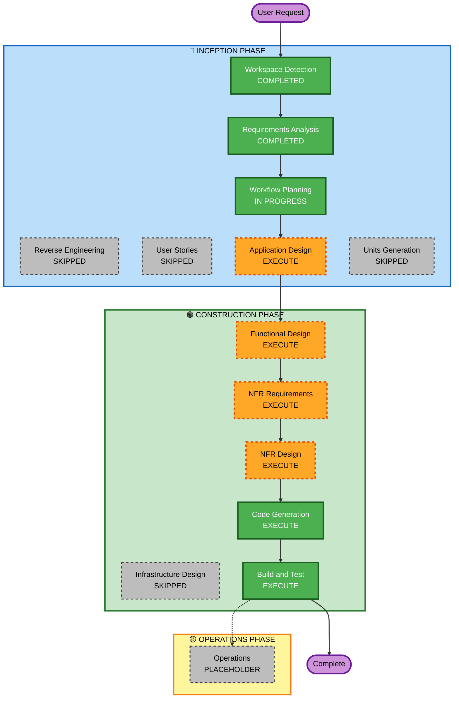

# Execution Plan — Water Intake Tracker

## Detailed Analysis Summary

### Change Impact Assessment
- **User-facing changes**: Yes — entirely new user-facing single-page application
- **Structural changes**: Yes — new project structure (React + Vite)
- **Data model changes**: Yes — localStorage schema for intake logs and history
- **API changes**: N/A — no external API; browser localStorage only
- **NFR impact**: Yes — security headers, input validation, error handling required

### Risk Assessment
- **Risk Level**: Low
- **Rollback Complexity**: Easy — greenfield, no existing code at risk
- **Testing Complexity**: Simple — pure frontend, no integration with external services

---

## Workflow Visualization



### Text Alternative

```
INCEPTION PHASE
  [x] Workspace Detection       - COMPLETED
  [-] Reverse Engineering       - SKIPPED  (greenfield project)
  [x] Requirements Analysis     - COMPLETED
  [-] User Stories              - SKIPPED  (single user type, simple scope)
  [x] Workflow Planning         - IN PROGRESS
  [ ] Application Design        - EXECUTE  (new React components needed)
  [-] Units Generation          - SKIPPED  (single deployment unit)

CONSTRUCTION PHASE
  [ ] Functional Design         - EXECUTE  (data models, business logic)
  [ ] NFR Requirements          - EXECUTE  (security baseline enabled)
  [ ] NFR Design                - EXECUTE  (security patterns to incorporate)
  [-] Infrastructure Design     - SKIPPED  (pure static SPA, no cloud infra)
  [ ] Code Generation           - EXECUTE  (React app implementation)
  [ ] Build and Test            - EXECUTE  (build + test instructions)

OPERATIONS PHASE
  [-] Operations                - PLACEHOLDER
```

---

## Phases to Execute

### 🔵 INCEPTION PHASE
- [x] Workspace Detection — **COMPLETED**
- [-] Reverse Engineering — **SKIPPED** — Greenfield project, no existing code
- [x] Requirements Analysis — **COMPLETED**
- [-] User Stories — **SKIPPED** — Single user type, clear requirements, no acceptance criteria ambiguity
- [x] Workflow Planning — **IN PROGRESS**
- [ ] Application Design — **EXECUTE**
  - **Rationale**: New React components needed (Progress display, History view, Goal settings, Intake logger); component dependencies and service layer (localStorage) need definition
- [-] Units Generation — **SKIPPED** — Single deployment unit, no decomposition needed

### 🟢 CONSTRUCTION PHASE
- [ ] Functional Design — **EXECUTE**
  - **Rationale**: localStorage data schema, auto-reset algorithm, history management logic need detailed design
- [ ] NFR Requirements — **EXECUTE**
  - **Rationale**: Security Baseline is enabled; tech stack confirmed but security patterns (input validation, error handling, CSP headers) must be specified
- [ ] NFR Design — **EXECUTE**
  - **Rationale**: NFR Requirements will execute; security patterns (Error Boundary, input sanitisation, CSP config) need incorporation into design
- [-] Infrastructure Design — **SKIPPED** — Pure static SPA; no cloud resources, no server infrastructure required
- [ ] Code Generation — **EXECUTE** (ALWAYS)
  - **Rationale**: Full React application implementation with all features and security controls
- [ ] Build and Test — **EXECUTE** (ALWAYS)
  - **Rationale**: Build, unit test, and verification instructions needed

### 🟡 OPERATIONS PHASE
- [-] Operations — **PLACEHOLDER** — Future deployment and monitoring workflows

---

## Estimated Timeline
- **Total Stages to Execute**: 7 (Workflow Planning, Application Design, Functional Design, NFR Requirements, NFR Design, Code Generation, Build and Test)
- **Estimated Duration**: 1 session

## Success Criteria
- **Primary Goal**: Fully functional Water Intake Tracker React SPA
- **Key Deliverables**:
  - React + Vite application with modern UI
  - Daily goal setting and water intake logging (preset + custom)
  - Progress bar with percentage
  - 7-day/30-day history view
  - Automatic midnight reset
  - localStorage persistence
  - Security controls: input validation, Error Boundary, security headers config
- **Quality Gates**:
  - All 10 acceptance criteria from requirements.md met
  - Security rules SECURITY-04, 05, 09, 10, 13, 15 compliant
  - Build succeeds with no lint errors
  - Unit tests pass
